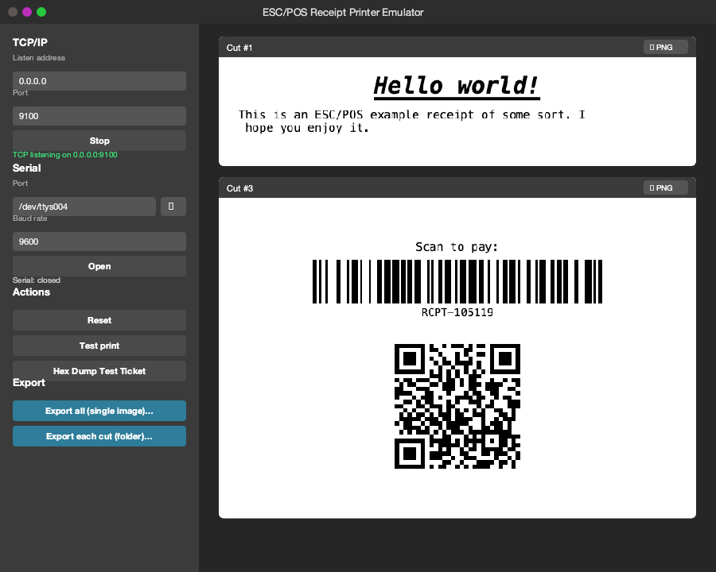

# ESC/POS Receipt Printer Emulator
🖨️ **This app emulates a networked receipt printer to test your ESC/POS commands against.**



### About
- Cross-platform application (Avalonia 12 + SkiaSharp + .NET 10), runs on Windows, macOS and Linux
- Listens for ESC/POS commands over **TCP/IP** and (optionally) a **serial port**
- Logs commands and visually represents the resulting receipt(s)
- Renders 1D barcodes and 2D QR codes, and signals buzzer / cash-drawer events
- Configure the TCP listen address/port and serial port live from the UI
- Export rendered tickets to PNG — all in one image, or one file per cut
- It support different text formattings in the same line, although a few combinations were tested.

> **Cross-platform fork.** This project began as a cross-platform port of
> [roydejong/EscPosEmulator](https://github.com/roydejong/EscPosEmulator) (originally a Windows/WPF
> app). It has been migrated to Avalonia + SkiaSharp + .NET 10 so it runs on Windows, macOS and
> Linux, and extended with barcode/QR rendering and a serial transport. All credit for the original
> emulator goes to the upstream author.

👷 **This is an unfinished experiment.** Use at your own risk and keep your expectations low. :)

### Download

Pre-built, **self-contained** apps (no .NET install required) are published on the
[Releases](../../releases) page:

| Platform | Artifact |
|----------|----------|
| Windows (x64) | `ReceiptPrinterEmulator-win-x64.zip` |
| Linux (x64) | `ReceiptPrinterEmulator-linux-x64.tar.gz` |
| macOS (Intel) | `ReceiptPrinterEmulator-osx-x64.zip` (`.app` bundle) |
| macOS (Apple Silicon) | `ReceiptPrinterEmulator-osx-arm64.zip` (`.app` bundle) |

Releases are produced by the [`Release`](.github/workflows/release.yml) GitHub Actions workflow on
each `v*` tag. macOS builds are not notarized — on first launch, right-click the `.app` → **Open**.

### Built with

- [.NET 10](https://dotnet.microsoft.com/) · [Avalonia 12](https://avaloniaui.net/) ·
  [SkiaSharp](https://github.com/mono/SkiaSharp) (rendering) ·
  [CommunityToolkit.Mvvm](https://github.com/CommunityToolkit/dotnet) (MVVM)
- [ZXing.Net](https://github.com/micjahn/ZXing.Net) (1D barcodes) ·
  [QRCoder](https://github.com/codebude/QRCoder) (QR codes) ·
  [System.IO.Ports](https://www.nuget.org/packages/System.IO.Ports) (serial)

### Supported commands

⚠️ Support is currently limited to only a subset of ESC/POS. Even the commands listed here may only be partially implemented.

- Raw Text
- LF: Line feed
- CR: Carriage return
- ESC Commands:
  - Initialize printer (`ESC @`)
  - Toggle italic (`ESC 4` / `ESC 5`) *[possibly deprecated?]*
  - Select font (`ESC M`)
  - Select charset (`ESC R`)
  - Select character table (`ESC t`)
  - Select justification (`ESC a`)
  - Select line spacing (`ESC 2` / `ESC 3`)
  - Toggle emphasis (`ESC E`)
  - Toggle underline (`ESC -`)
  - Set print text mode (`ESC !`)
  - Full cut (`ESC m`)
  - Partial cut (`ESC i`)
  - Print and feed n lines (`ESC d`)
  - Print and feed paper (`ESC J`)
  - Generate pulse / kick cash drawer (`ESC p m t1 t2`)
- Control characters:
  - Buzzer / beeper (`BEL`, 0x07)
- FS Commands:
  - Print stored logo (`FS p n m`)
  - Auto cut (`FS } 0x60 n`)
- GS Commands:
  - Select character size
  - Select cut mode and cut paper
  - Paper eject (`GS e n [m t]`)
  - Print raster image (`GS v 0 [m xL xH yL yH ...pixels]`)
  - Print 1D barcode (`GS k`) — UPC-A/E, EAN-13/8, CODE39, CODE93, CODE128, ITF, CODABAR (both function A & B forms)
  - Set barcode height / module width (`GS h` / `GS w`)
  - Select HRI text position / font (`GS H` / `GS f`)
  - Print 2D QR Code (`GS ( k`, cn=49) — model, module size, error-correction level, store & print

### Not yet implemented

Common commands that are **not** handled yet (parsing one of these will currently be ignored or, for
prefixes the interpreter doesn't recognise, may raise an error):

- **Real-time commands** (`DLE` prefix): real-time status, real-time cash-drawer (`DLE DC4`), power-off — currently not supported (the interpreter throws on `DLE`).
- **Page mode** (`ESC L`, `ESC S`, `ESC W`, `FF`, `CAN`) — only Standard mode is emulated.
- **Status / transmit-back commands** (`GS r`, `GS I`, `DLE EOT`, `GS ( H`) — the emulator never sends data back to the host.
- **Other 2D symbologies** via `GS ( k`: PDF417 (cn=48), MaxiCode (cn=50), Aztec, DataMatrix — only QR (cn=49) is implemented.
- **Bit-image** modes other than raster: `ESC *`, `GS *` / `GS /` (download bit image).
- **User-defined characters** (`ESC &`, `ESC %`, `ESC ?`).
- **Print-density / mechanism** controls (`GS ( E`, `GS ( K`, `GS ( L` graphics, motion units `GS P`).
- **Buzzer via the manufacturer command** (`ESC ( A` / `GS ( A`) — only the simple `BEL` buzzer is handled.
- **International / code-page glyphs** beyond what the bundled font and the `ESC R` / `ESC t` mapping cover.

Contributions welcome — new commands follow the simple `BaseCommand` pattern in
[`EscPos/Commands`](EscPos/Commands) and are registered in
[`EscPosInterpreter.RegisterCommands`](EscPos/EscPosInterpreter.cs).

### Connecting

The emulator accepts ESC/POS data over two transports. Both can be changed **live from the UI**
(left panel): pick a TCP listen address and port and Start/Stop the listener, or select a serial
port + baud and Open/Close it (⟳ refreshes the port list). The environment variables below set the
**initial** values at startup:

| Variable | Default | Meaning |
|----------|---------|---------|
| `ESCPOS_LISTEN_ADDRESS` | `0.0.0.0` | Initial TCP bind address (`0.0.0.0` = all interfaces, `127.0.0.1` = localhost). |
| `ESCPOS_TCP_PORT` | `9100` | Initial TCP listen port. Set to `off` / `0` to start with TCP stopped. |
| `ESCPOS_SERIAL_PORT` | *(unset)* | Serial device to auto-open (e.g. `/dev/ttys004`, `COM3`). Unset = serial closed. |
| `ESCPOS_SERIAL_BAUD` | `9600` | Serial baud rate. |
| `ESCPOS_DEBUG_DUMP` | *(off)* | Set to `1` to dump every received payload to `last_*` files. |

Examples:

```sh
dotnet run                                   # TCP only, port 9100
ESCPOS_TCP_PORT=9200 dotnet run              # TCP on 9200
ESCPOS_SERIAL_PORT=/dev/ttys004 dotnet run   # TCP 9100 + serial
ESCPOS_TCP_PORT=off ESCPOS_SERIAL_PORT=COM3 dotnet run   # serial only
```

The status panel shows the active TCP endpoint and serial port.

#### Testing serial without hardware (app-to-app on one machine)

You don't need a USB serial adapter. Create a **virtual serial bridge** — a pair of linked ports —
then point the emulator at one end and your POS application (or a shell) at the other. Bytes written
to one end appear on the other.

**macOS / Linux** — using [`socat`](http://www.dest-unreach.org/socat/) (`brew install socat` /
`apt install socat`). A helper script is included:

```sh
./scripts/serial-bridge.sh
# It prints a linked pair, e.g.:
#   PORT A (emulator): /dev/ttys004
#   PORT B (your app): /dev/ttys005
# Leave it running.
```

Then, in two more terminals:

```sh
# Terminal 2 — run the emulator on port A
ESCPOS_SERIAL_PORT=/dev/ttys004 dotnet run

# Terminal 3 — send a receipt from "another app" on port B
cat test_receipt.txt > /dev/ttys005
#   …or from your own program, just open /dev/ttys005 like a normal serial port
#   (9600 8N1) and write ESC/POS bytes to it.
```

The receipt appears in the emulator window. Because the interpreter is stateful across reads,
fragmented serial writes (commands split across packets) are handled correctly.

**Windows** — install [com0com](https://com0com.sourceforge.net/) and create a linked pair
(e.g. `COM3` ↔ `COM4`). Run the emulator with `ESCPOS_SERIAL_PORT=COM3` and have your application
write to `COM4`.

### Exporting tickets

Each cut (`ESC i` / `ESC m` / `GS V`) starts a new receipt — a "page". The **Export** buttons in the
left panel save the rendered tickets as PNG:

- **Export all (single image)** — stacks every receipt into one tall PNG (a save dialog).
- **Export each cut (folder)** — writes one `receipt_NNN.png` per cut into a chosen folder.

### Building & running

```sh
dotnet run
```

Requires the .NET 10 SDK. The app runs on Windows, macOS and Linux.

- **Windows / macOS:** no extra setup — native rendering libraries ship with the Avalonia packages.
- **Linux:** install the usual font/render native deps if they are missing, e.g.
  `sudo apt install libfontconfig1 libfreetype6` (Debian/Ubuntu).

### Fonts & license

Receipt text is rendered with **[JetBrains Mono](https://www.jetbrains.com/lp/mono/)**, bundled under
[`Assets/Fonts/`](Assets/Fonts) so output is identical across platforms. JetBrains Mono is licensed
under the **SIL Open Font License 1.1**; the full license text is included at
[`Assets/Fonts/OFL.txt`](Assets/Fonts/OFL.txt). Per the OFL, the font is redistributed here under its
original license and "JetBrains Mono" is a trademark of JetBrains s.r.o. To swap in a different
monospace font, replace the `receipt-mono*.ttf` files (and keep its license alongside).

### Emulated printer

This program emulates a printer with the following specifications:

 - 80mm paper width
 - 72mm printing width
 - 180x180dpi
 - ASCII Font A/B: 12x24 pixels
 - Automatic line feed
