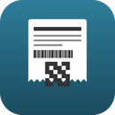
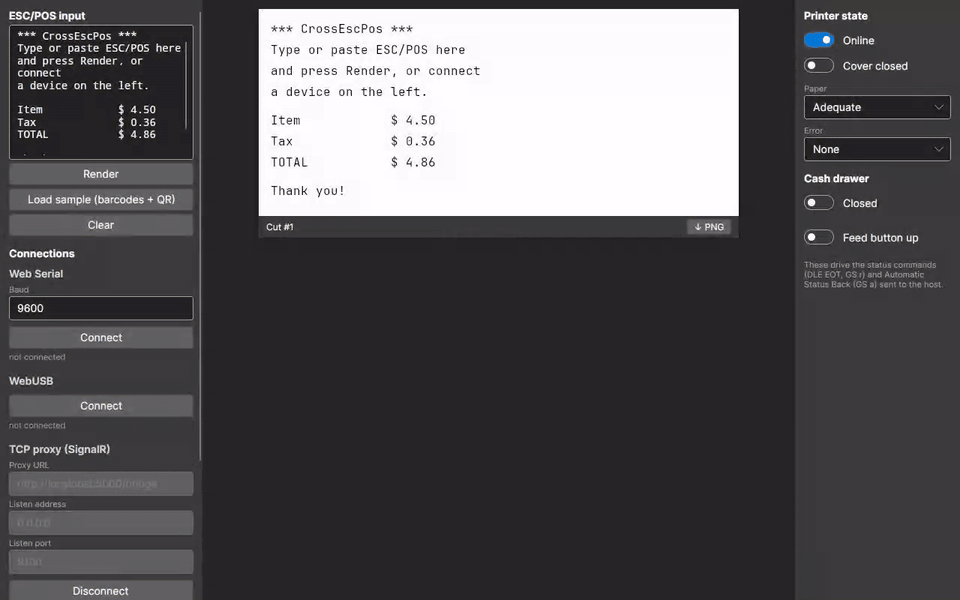
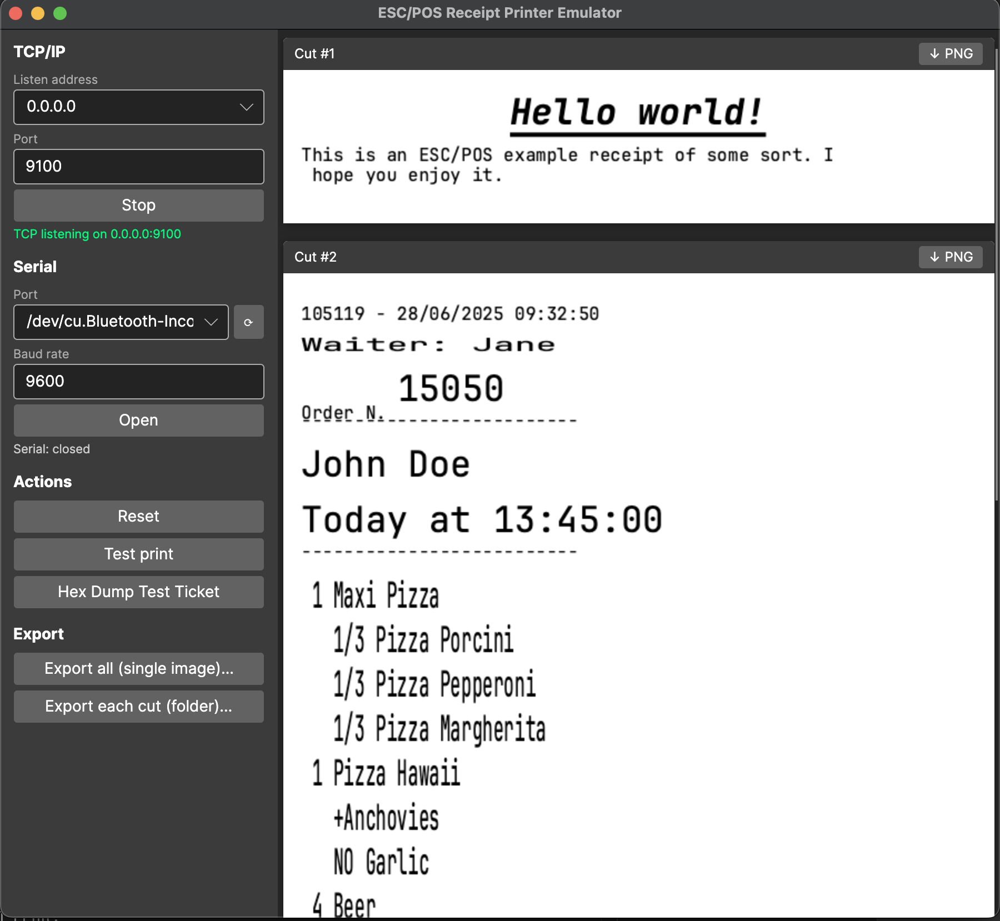

<h1 align="center">
  <br>
  CrossEscPos
</h1>

<h4 align="center">A receipt printer emulator for testing ESC/POS, on Windows, macOS, Linux and in the browser. Built with <a href="https://avaloniaui.net/">Avalonia</a>.</h4>

<p align="center">
  <a href="https://github.com/danielmeza/CrossEscPosEmulator/actions/workflows/ci.yml"></a>
  <a href="https://github.com/danielmeza/CrossEscPosEmulator/releases/latest"></a>
  <a href="https://www.nuget.org/packages/CrossEscPos.Core"></a>
  <a href="LICENSE"></a>
</p>

<p align="center">
  <a href="#key-features">Key features</a> •
  <a href="#download">Download</a> •
  <a href="#quick-start">Quick start</a> •
  <a href="#from-wpf-to-avalonia-what-the-migration-cost">WPF to Avalonia</a> •
  <a href="docs/README.md">Docs</a> •
  <a href="https://danielmeza.github.io/CrossEscPosEmulator/app/">Live demo</a>
</p>

<p align="center">
  
</p>

Testing receipt printing usually means a real printer, a roll of paper and a lot of walking back and
forth. CrossEscPos stands in for the printer: point your point-of-sale software at it over TCP, serial or
USB, and each receipt prints on screen. Status queries get real answers, so you can also test how your
software handles paper-out, an open cover or a cash drawer.

> **Avalonia Port Challenge entry.** CrossEscPos is a cross-platform port of
> [roydejong/EscPosEmulator](https://github.com/roydejong/EscPosEmulator), a Windows-only WPF app. See
> [From WPF to Avalonia](#from-wpf-to-avalonia-what-the-migration-cost) for before/after screenshots and
> what the migration cost.

## Key features

- **The connections a real printer has.** TCP/IP (port 9100) and serial on the desktop; Web Serial,
  WebUSB and a TCP proxy in the browser.
- **Real receipts.** Text styles, 1D barcodes, 2D codes (QR, PDF417, DataMatrix, Aztec), bit images and
  page mode. See [Supported commands](docs/Supported-Commands.md).
- **It talks back.** Answers `DLE EOT`, `GS r` and Automatic Status Back. The **Printer state** panel
  simulates paper-out, an open cover, the cash drawer, offline and error states, and like real hardware
  the printer drops jobs while it isn't ready.
- **A built-in test client.** The **Monitor** prints sample jobs and shows the status your software would
  receive.
- **Buzzer and cash drawer.** Both signal with a sound and an on-screen toast.
- **PNG export.** Save every receipt in one image, or one file per cut.
- **Embeddable.** A headless core and NuGet packages with swappable render backends (SkiaSharp, or
  ImageSharp with no native dependencies).

## Download

| Platform | Download |
|----------|----------|
|  | [x64 (.zip)](https://github.com/danielmeza/CrossEscPosEmulator/releases/latest/download/CrossEscPos-win-x64.zip) |
|  | [Apple silicon (.zip)](https://github.com/danielmeza/CrossEscPosEmulator/releases/latest/download/CrossEscPos-osx-arm64.zip) · [Intel (.zip)](https://github.com/danielmeza/CrossEscPosEmulator/releases/latest/download/CrossEscPos-osx-x64.zip) |
|  | [x64 (.tar.gz)](https://github.com/danielmeza/CrossEscPosEmulator/releases/latest/download/CrossEscPos-linux-x64.tar.gz) |
|  | [Run it online](https://danielmeza.github.io/CrossEscPosEmulator/app/), no install |

The links download the latest [release](https://github.com/danielmeza/CrossEscPosEmulator/releases). The
builds are self-contained, so you don't need .NET installed. The libraries are on NuGet as
`CrossEscPos.*`; see [Packages](docs/Packages.md).

> [!NOTE]
> The macOS apps aren't notarized yet. If macOS says CrossEscPos "is damaged and can't be opened", see
> [Troubleshooting](#troubleshooting).

## Quick start

1. Start the app. It listens on TCP port 9100 on all interfaces.
2. Send it a receipt from a terminal, or point your POS software at `localhost:9100` as a network
   printer:

   ```sh
   printf 'Hello from CrossEscPos\n\n\n\035V\000' | nc -w 1 localhost 9100
   ```

3. Click **Open monitor…** to print sample receipts, barcodes and QR codes, and flip the switches in the
   **Printer state** panel to see the status your software would receive.

To change the port, open a serial port, or test serial without hardware, see
[Connecting](docs/Connecting.md).

To render ESC/POS from your own .NET code, start with [Getting started](docs/Getting-Started.md):

```csharp
var printer = new ReceiptPrinter(PaperConfiguration.Default,
    new SkiaImageFactory(), new SkiaTypefaceProvider());
printer.FeedEscPos(escPosBytes);                     // ESC/POS is binary: feed the raw bytes
using var image = printer.CurrentReceipt.Render();   // IReceiptImage
new SkiaImageEncoder().EncodePng(image, outputStream);
```

## From WPF to Avalonia: what the migration cost

*Entered in the [Avalonia Port Challenge](https://avaloniaui.net/blog/avalonia-port-challenge). The same
write-up is on the [project site](https://danielmeza.github.io/CrossEscPosEmulator/), next to a
[live browser demo](https://danielmeza.github.io/CrossEscPosEmulator/app/).*

| Before: WPF, Windows only | After: Avalonia 12 on macOS |
|:---:|:---:|
|  |  |
| **After: Linux** | **After: browser (WebAssembly)** |
|  |  |

### Starting point

The upstream app ([roydejong/EscPosEmulator](https://github.com/roydejong/EscPosEmulator), last
updated July 2025) targeted `net9.0-windows7.0` with `UseWPF`: 48 C#/XAML files, about 2,400 lines.
Windows was wired in at four levels:

- **Rendering.** Every receipt line drew itself with GDI+ (`System.Drawing.Bitmap` and `Graphics`),
  which is Windows-only on .NET 6 and later. The GDI+ types were part of the core interface,
  `IReceiptPrintable.Render(Bitmap, Graphics, int, int)`. To show a receipt, the window saved each
  bitmap into a BMP `MemoryStream` and loaded it back as a WPF `BitmapImage`.
- **UI.** Code-behind only. `MainWindow.xaml.cs` created `Image` controls by hand, found them again
  by a GUID-derived `Name`, and added or removed them from a `StackPanel`.
- **OS calls.** A `user32!FlashWindow` P/Invoke and `System.Media.SystemSounds` signalled new jobs.
- **Assumptions.** TCP was the only transport, and the test receipt was read from the current
  working directory.

The ESC/POS interpreter (one command class per opcode, registered in `EscPosInterpreter`) had no UI
or Windows dependency, so its design carried over unchanged. It is now the headless
`CrossEscPos.Core` package.

### What changed, and what each part cost

| Area | WPF original | Avalonia port | What it took |
|---|---|---|---|
| Rendering | GDI+ `Bitmap` / `Graphics` | SkiaSharp, later behind a backend-neutral `IReceiptCanvas`, plus a fully managed ImageSharp backend | The biggest single job. The text-line renderer (styles, sizes, justification, underline) was rewritten. System fonts differ per OS, so the same receipt measured differently on each; embedding JetBrains Mono (OFL) made output identical everywhere. The ImageSharp backend later needed its advance widths matched to Skia's. |
| UI | XAML + code-behind | AXAML + MVVM (CommunityToolkit.Mvvm); receipts bound to a reusable `ReceiptView` control | The markup ported almost line for line: `Window`, `DockPanel`, `StackPanel` and `ScrollViewer` all exist in Avalonia. The work was moving the code-behind into view models and bindings. |
| Win32 calls | `FlashWindow`, `SystemSounds` | `INotificationService`: `afplay` on macOS, `Console.Beep` on Windows, `paplay`/`aplay` on Linux, plus an in-window toast | Avalonia has no cross-platform system-sound API, so each OS gets its own strategy. |
| Files | Relative to the working directory | Avalonia `StorageProvider` for PNG export; app-relative asset paths | The working-directory assumption broke in the packaged app and was fixed right after the first release. |
| Transports | TCP | TCP and serial (`System.IO.Ports`); the Monitor adds direct USB (libusb) | Port names differ per OS (`COM3`, `/dev/ttyUSB0`, `/dev/cu.*`). A Homebrew-installed libusb wasn't found until the app added the usual install paths to `NATIVE_DLL_SEARCH_DIRECTORIES` at startup. |
| Packaging | One Windows `.exe` | Self-contained win-x64, linux-x64, osx-x64 and osx-arm64 builds from one CI matrix; a script builds the macOS `.app` | Unsigned macOS bundles were reported as "damaged", so the bundle is now ad-hoc signed. Notarization needs a paid Apple ID, so the README documents clearing the quarantine flag instead. |
| Browser | n/a | The same app as an Avalonia WASM head (`net10.0-browser`) | Platform edges sit behind `IPlatformServices`. A browser can't listen on TCP, so an ASP.NET Core SignalR host opens the socket and relays jobs to the page. Serial and USB go through Web Serial and WebUSB via JS interop. The storage API's save picker failed in the browser, so export downloads a JS blob instead. |

### The numbers

- **Time:** 7 days with commits over 5 weeks, per the git history. The port and desktop parity landed
  on June 5–6, 2026 (PRs #1–#7), the layered-package refactor on June 20–21 (#8–#10), and the
  browser head on July 4–7 (#11–#16).
- **Size:** from 48 files and ~2.4k lines to 168 files and ~10k lines of C# and AXAML, across 11
  projects, 2 samples and 2 test projects. Most of the growth is new features (barcodes, 2D codes,
  status commands, printer-state simulation, the Monitor, serial/USB, the browser head), not port
  overhead. The port PR itself (#1) was +2,525 / −487 lines across 60 files.
- **Tests:** 131 xUnit tests (89 test methods). They run the interpreter against a synthetic render backend,
  which proves the core is headless, and exercise the controls with Avalonia.Headless.
- **Tools:** built with AI assistance (Claude Code); the commits carry `Co-Authored-By` trailers.

### What was easy, and what hurt

- **Easy:** XAML to AXAML, the Fluent theme, `Dispatcher.UIThread`, and headless UI testing. The UI
  layer was the smallest part of the port.
- **Hurt:** removing GDI+. It was part of the core interfaces, not just the view, so the renderer
  had to be redesigned before anything else could move. After that came per-OS native dependencies
  (libusb, fontconfig on Linux, macOS signing) and the browser sandbox (no sockets, no raw file
  system).
- **Would do again:** put the drawing surface behind an interface first. Once `IReceiptCanvas`
  existed, the ImageSharp backend (a community contribution) and the browser head each landed within
  a few days.

## Documentation

The long-form guides live in [`docs/`](docs/README.md) and are published as the
[wiki](https://github.com/danielmeza/CrossEscPosEmulator/wiki).

| Guide | What's in it |
|-------|--------------|
| [Using the app](docs/Using-the-App.md) | The Monitor, the printer state panel, PNG export, choosing the render backend |
| [Connecting](docs/Connecting.md) | TCP and serial, environment variables, testing serial without hardware |
| [Browser app](docs/Browser-App.md) | The browser version, Web Serial and WebUSB, and the SignalR host for TCP |
| [Supported commands](docs/Supported-Commands.md) | The emulated printer, the ESC/POS it understands, and what's missing |
| [Getting started](docs/Getting-Started.md) and [Packages](docs/Packages.md) | Using the NuGet libraries in your own app |
| [Architecture](docs/Architecture.md) | The packages, one app with two heads, the bundled font |
| [Building and testing](docs/Building-and-Testing.md) | Building from source, running the tests, how releases are published |

## Troubleshooting

<details>
<summary>macOS says the app "is damaged and can't be opened"</summary>

The `.app` is ad-hoc signed but not notarized, so macOS quarantines it after download. Clear the
quarantine flag once, then open it:

```sh
xattr -dr com.apple.quarantine /path/to/CrossEscPos.app
open /path/to/CrossEscPos.app
```

</details>

<details>
<summary>The app fails to start or text is missing on Linux</summary>

Install the font and rendering libraries if they're missing, for example on Debian or Ubuntu:

```sh
sudo apt install libfontconfig1 libfreetype6
```

</details>

<details>
<summary>Port 9100 is already in use</summary>

Pick another port in the **TCP/IP** panel and click **Start**, or start the app with
`ESCPOS_TCP_PORT=9200`. See [Connecting](docs/Connecting.md) for all the environment variables.

</details>

<details>
<summary>The Monitor can't find libusb (direct USB printing)</summary>

USB printing needs the native libusb library: `brew install libusb` on macOS, or
`sudo apt install libusb-1.0-0` on Debian and Ubuntu. It ships with the Windows build. The operating
system must not already be holding the printer.

</details>

<details>
<summary>Web Serial or WebUSB says "unsupported" in the browser</summary>

Both APIs are only available in Chromium-based browsers such as Chrome and Edge, and only on HTTPS or
`localhost`. Receiving over TCP in the browser needs the relay host:
`dotnet run --project samples/CrossEscPos.Host`. See [Browser app](docs/Browser-App.md).

</details>

## Limitations

ESC/POS is a large command set, and CrossEscPos covers the common part of it. Not implemented yet:
page-mode positioning, user-defined glyph substitution, MaxiCode and GS1 DataBar, the `GS ( L` graphics
commands, and Katakana/CJK code pages. See [Not yet implemented](docs/Supported-Commands.md#not-yet-implemented)
for the details, and expect gaps.

## Contributing and support

- Found a bug, or a command that prints wrong? [Open an issue](https://github.com/danielmeza/CrossEscPosEmulator/issues).
  Attach the ESC/POS bytes if you can: run the app with `ESCPOS_DEBUG_DUMP=1` to save them.
- Pull requests are welcome. New commands follow the `BaseCommand` pattern described in
  [Adding a command](docs/Supported-Commands.md#adding-a-command). Run `dotnet test CrossEscPos.slnx`
  before you open one; warnings fail the build. See [Building and testing](docs/Building-and-Testing.md).

## Credits and license

- The original emulator is [EscPosEmulator](https://github.com/roydejong/EscPosEmulator) by Roy de Jong,
  and all credit for its design goes to him and its contributors. Thanks to
  [@yhonc9](https://github.com/yhonc9) for the ImageSharp render backend.
- Built with [.NET 10](https://dotnet.microsoft.com/), [Avalonia 12](https://avaloniaui.net/),
  [SkiaSharp](https://github.com/mono/SkiaSharp), [CommunityToolkit.Mvvm](https://github.com/CommunityToolkit/dotnet),
  [ZXing.Net](https://github.com/micjahn/ZXing.Net), [QRCoder](https://github.com/codebude/QRCoder),
  [Ardalis.SmartEnum](https://github.com/ardalis/SmartEnum), [System.IO.Ports](https://www.nuget.org/packages/System.IO.Ports),
  [ESC-POS-.NET](https://github.com/lukevp/ESC-POS-.NET) (the Monitor) and
  [LibUsbDotNet](https://github.com/LibUsbDotNet/LibUsbDotNet) (direct USB printing).
- Released under the [MIT License](LICENSE). Receipts are rendered with JetBrains Mono under the SIL Open
  Font License; see [Fonts and license](docs/Architecture.md#fonts-and-license).
