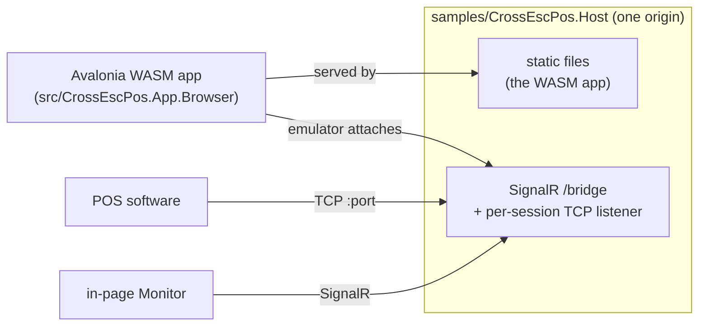

# Browser App (`src/CrossEscPos.App.Browser` + `samples/CrossEscPos.Host`)

The emulator runs **in the browser** as the *same* Avalonia application as the desktop — same views,
view models, receipts, printer-state panel, PNG export, and Monitor. There's no separate Blazor app; the
[desktop and browser are two thin heads over one shared `CrossEscPos.App`](README.md), and the browser head is
that app compiled to **WebAssembly** (Avalonia's `net10.0-browser` target, rendering with SkiaSharp).



## Run it

Two ways, depending on whether you need TCP reception:

```sh
# Just the app (paste/upload, Web Serial, WebUSB) on a dev server:
dotnet run --project src/CrossEscPos.App.Browser

# App + backend on ONE origin — adds the SignalR TCP proxy so real POS software can reach it.
# The first run publishes the WASM app into the host's wwwroot (cached after); browse to the printed URL.
dotnet run --project samples/CrossEscPos.Host
```

> **Building the WASM head needs the `wasm-tools` workload** (`dotnet workload install wasm-tools`).

## Full parity with desktop

Everything the desktop does works here, because it's the same app — only the platform edges differ,
injected via `IPlatformServices`:

| | Desktop head | Browser head |
| --- | --- | --- |
| Transports | TCP + serial | **Web Serial + WebUSB + SignalR TCP proxy** |
| Export | native save dialog | browser **download** (same Avalonia storage API) |
| Monitor | test-client **window** | in-page **overlay** (SignalR round-trip) |
| Render backend | Skia (runtime-selectable) | Skia (Avalonia's browser renderer links it) |

## Connections

The connections panel is shared with desktop — each transport self-describes its fields, so one view
renders them all. In the browser you get:

- **Web Serial** — connect to a serial device (choose the baud), via the [Web Serial API](https://developer.mozilla.org/en-US/docs/Web/API/Web_Serial_API).
- **WebUSB** — connect to a USB device, via the [WebUSB API](https://developer.mozilla.org/en-US/docs/Web/API/USB) (with a CDC-ACM serial polyfill for USB-serial adapters).
- **TCP proxy (SignalR)** — the browser can't open a raw TCP socket, so the emulator asks the host to
  open one for it. This **auto-connects on load** (matching the desktop's auto-started TCP listener): the
  emulator attaches to the hub and the host opens a per-session `TcpListener` on the **Listen address** +
  **Listen port** (default `0.0.0.0:9100`) with no manual step. POS software connecting to that port
  streams ESC/POS to the in-page emulator, and the printer's status replies flow back. Adjust the fields
  and reconnect to change them; the listener is torn down on disconnect and re-opened on reconnect. (Auto-
  connect quietly no-ops when the app is served without the host, e.g. a bare dev server.)

See **[Transports → Browser transports](Transports.md#browser-transports)** for the data flow and the
strongly-typed hub contract.

## Monitor

The [Monitor test-client](Using-the-App.md#monitor-built-in-test-client) is shared too — click **Open monitor…** to show it as
an in-page overlay. It has the **same multi-transport UI as desktop**: pick a transport and drive a
printer with it. Its test jobs (sample receipt, barcodes, QR/PDF417/DataMatrix/Aztec, cut, drawer,
buzzer) and status display are identical; the transports are the browser-appropriate ones:

- **SignalR proxy** — round-trips through the host to the **in-page emulator** (status parsed from the
  4-byte Automatic Status Back block); no native transport needed.
- **Network (TCP)** — the browser can't open a raw socket, so the host **dials a real network printer**
  (host + port) on its behalf and bridges the job + status back — the equivalent of the desktop TCP mode.
- **Web Serial** — sends to a real serial device (pick the baud; the browser's port picker selects it).
- **WebUSB** — sends to a real USB device (paired devices are listed by VID:PID; the picker pairs new ones).

Serial/USB use their own JS sender channels so they don't clash with the emulator's own connections.

## The host in one paragraph

`samples/CrossEscPos.Host` is a small ASP.NET Core app that does two jobs on one origin: it serves the
published WASM app as static files (`UseBlazorFrameworkFiles()` + a fallback to `index.html`), and it
hosts the SignalR broker at `/bridge`. Same origin means the browser reaches the hub with **no CORS**.
A `net10.0` host can't `ProjectReference` the `net10.0-browser` WASM head (unlike Blazor's hosted
template — you'll hit `NU1201`), so the host **publishes** the client into its `wwwroot` on first build
instead (skipped during a solution build to avoid racing the shared-library build).

## Publish / host it yourself

```sh
dotnet publish samples/CrossEscPos.Host -c Release -o publish/host -p:PublishWasmClient=true
```

`publish/host` is a self-contained ASP.NET Core app: run it, and it serves the WASM app plus the broker.
If you only want the **static** app (no TCP proxy), publish the head alone and serve its `wwwroot/` from
any static host:

```sh
dotnet publish src/CrossEscPos.App.Browser -c Release -p:PublishTrimmed=false -o publish/web
```

## Embedding the pipeline in your own app

Don't need the UI? The render pipeline is headless and managed — reference `CrossEscPos.Core` +
`CrossEscPos.Rendering.ImageSharp` and call the two-line pipeline from [Getting Started](Getting-Started.md).
The managed **ImageSharp** backend needs no native relink, so it "just works" in WASM:

```csharp
var printer = new ReceiptPrinter(PaperConfiguration.Default,
    new ImageSharpImageFactory(), new ImageSharpTypefaceProvider());
printer.FeedEscPos(bytes);
byte[] png = new ImageSharpImageEncoder().EncodePng(printer.CurrentReceipt.Render());
// → data:image/png;base64,{Convert.ToBase64String(png)} into an 
```
