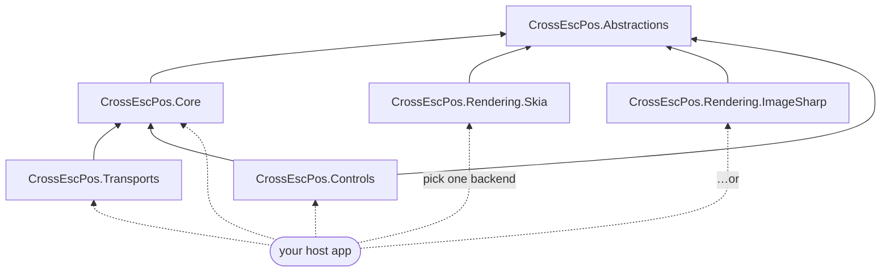

# Packages

CrossEscPos is split into layered, independently-usable packages so you can take only what you need —
the headless emulator, a render backend, the transports, and/or the Avalonia controls.

| Package | What it gives you | Depends on |
| --- | --- | --- |
| **CrossEscPos.Abstractions** | Backend-agnostic contracts: `IReceiptCanvas`, `IReceiptImage`, `IReceiptImageFactory`, `ITypefaceProvider`, `IImageEncoder`, `IReceiptPrintable`, `IPrinterResponder` | — |
| **CrossEscPos.Core** | The headless ESC/POS emulator: `ReceiptPrinter`, the interpreter, the receipt document model, barcode/QR | Abstractions |
| **CrossEscPos.Rendering.Skia** | The default render backend (SkiaSharp, native); fonts embedded | Abstractions |
| **CrossEscPos.Rendering.ImageSharp** | A 100% managed render backend (ImageSharp) — no native dependency, runs in the browser (WASM) with no native relink; byte-compatible output with Skia | Abstractions |
| **CrossEscPos.Transports** | TCP / serial / USB transports that feed a printer (desktop) | Core |
| **CrossEscPos.Controls** | Reusable Avalonia controls: `ReceiptView`, `PrinterStatePanel` | Core, Avalonia |

Everything lives under the single `CrossEscPos.*` namespace root (organized by feature, e.g.
`CrossEscPos.Emulator`, `CrossEscPos.Graphics`, `CrossEscPos.Controls`), so types resolve across the
packages regardless of which one they ship in.

## How the packages depend on each other



## Choosing a render backend

| | `Rendering.Skia` | `Rendering.ImageSharp` |
| --- | --- | --- |
| Implementation | native `libSkiaSharp` | 100% managed (SixLabors.ImageSharp) |
| Browser (WASM) | needs `wasm-tools` + native relink (~23 MB runtime) | **just works** — no native relink |
| Speed | faster (native raster) | fine for receipt rendering |
| Output | reference | byte-compatible with Skia |
| Default in | desktop app, server | browser app |

Both embed JetBrains Mono and produce the same receipts. See **[Rendering & Backends](Rendering-and-Backends.md)**.

## Install

The packages are on NuGet, published by the `Release` workflow on each `v*` tag:

```sh
dotnet add package CrossEscPos.Core
dotnet add package CrossEscPos.Rendering.Skia
# or the managed backend:
dotnet add package CrossEscPos.Rendering.ImageSharp
# …and Controls / Transports as needed
```

Prefer local builds? `dotnet pack -c Release` emits the `.nupkg` files under each project's
`bin/Release`, or reference the projects directly with `dotnet add reference`.
