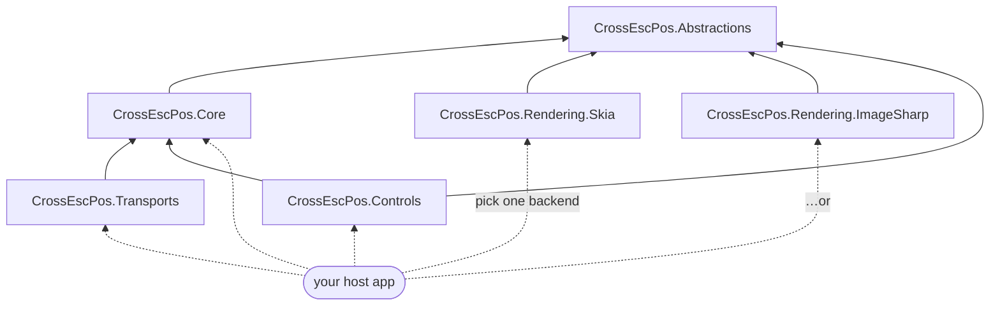

# Packages

CrossEscPos is split into layered, independently-usable packages so you can take only what you need —
the headless emulator, a render backend, the transports, and/or the Avalonia controls.

| Package | What it gives you | Depends on |
| --- | --- | --- |
| **CrossEscPos.Abstractions** | Backend-agnostic contracts: `IReceiptCanvas`, `IReceiptImage`, `IReceiptImageFactory`, `ITypefaceProvider`, `IImageEncoder`, `IReceiptPrintable`, `IPrinterResponder` | — |
| **CrossEscPos.Core** | The headless ESC/POS emulator: `ReceiptPrinter`, the interpreter, the receipt document model, barcode/QR | Abstractions |
| **CrossEscPos.Rendering.Skia** | The default render backend (SkiaSharp, native); fonts embedded | Abstractions |
| **CrossEscPos.Rendering.ImageSharp** | A 100% managed render backend (ImageSharp) — no native dependency, runs in the browser (WASM) with no native relink; output matches Skia | Abstractions |
| **CrossEscPos.Transports** | TCP / serial / USB transports that feed a printer (desktop) | Core |
| **CrossEscPos.Controls** | Reusable Avalonia controls: `ReceiptView`, `PrinterStatePanel` | Core, Avalonia |

## Dependency floors changed in 1.4.0

Both ImageSharp-referencing packages moved to **SixLabors.ImageSharp 4.1.2**, the only release patched
against the 2026-10-07 advisory batch (five findings reach every 2.x and 3.x release; nothing in those
lines is patched).

| Package | ImageSharp before | ImageSharp in 1.4.0 |
| --- | --- | --- |
| **CrossEscPos.Rendering.ImageSharp** | 3.1.12 (+ ImageSharp.Drawing 2.1.7) | **4.1.2** (+ ImageSharp.Drawing 3.1.2) |
| **CrossEscPos.Transports** | 2.1.13 | **4.1.2** |

`CrossEscPos.Transports` calls no ImageSharp API itself — the reference only exists to lift
ESCPOS_NET's transitive pin — but raising the floor is still a breaking change for one combination.
**If you use `CrossEscPos.Transports` together with ESCPOS_NET's own image printing, it stops
working:** `ESCPOS_NET.Emitters.BaseCommandEmitter.PrintImage` calls `Image.Load<TPixel>(byte[])`,
removed after ImageSharp 2.x, so it throws `MissingMethodException`. Measured against ESCPOS_NET
3.0.0, which is its latest release:

| ImageSharp | `PrintImage` |
| --- | --- |
| 2.1.13 | works |
| 3.1.12 | `MissingMethodException: Image.Load(Byte[])` |
| 4.1.2 | `MissingMethodException: Image.Load(Byte[])` |

So it breaks going from **2.x to 3.x, not from 3.x to 4.x** — anyone already resolving ImageSharp 3.x
(for example through `CrossEscPos.Rendering.ImageSharp` 1.2.0–1.3.2) has been in that state since
then. ESCPOS_NET's other ImageSharp-dependent member, `ToSingleBitPixelByteArray`, still works on
4.1.2. If you need `PrintImage`, render the image through `CrossEscPos.Rendering.ImageSharp` or
`CrossEscPos.Rendering.Skia` and send the bytes yourself, rather than pinning ImageSharp back down to
a version with five unpatched advisories.

Building these packages from source in `-c Release` needs a Six Labors licence key; see
**[Building and testing](Building-and-Testing.md)**. Consuming them does not — build assets do not
flow transitively and every ImageSharp dependency is packed with `exclude="Build,Analyzers"`.

Everything lives under the single `CrossEscPos.*` namespace root (organized by feature, e.g.
`CrossEscPos.Emulator`, `CrossEscPos.Graphics`, `CrossEscPos.Controls`), so types resolve across the
packages regardless of which one they ship in.

## How the packages depend on each other


```mermaid
flowchart BT
    Abstractions["CrossEscPos.Abstractions"]
    Core["CrossEscPos.Core"] --> Abstractions
    Skia["CrossEscPos.Rendering.Skia"] --> Abstractions
    ImageSharp["CrossEscPos.Rendering.ImageSharp"] --> Abstractions
    Transports["CrossEscPos.Transports"] --> Core
    Controls["CrossEscPos.Controls"] --> Core
    Controls --> Abstractions

    Host(["your host app"]) -.-> Core
    Host -.->|"pick one backend"| Skia
    Host -.->|"…or"| ImageSharp
    Host -.-> Controls
    Host -.-> Transports
```

## Choosing a render backend

| | `Rendering.Skia` | `Rendering.ImageSharp` |
| --- | --- | --- |
| Implementation | native `libSkiaSharp` | 100% managed (SixLabors.ImageSharp) |
| Browser (WASM) | needs `wasm-tools` + native relink (~23 MB runtime) | **just works** — no native relink |
| Speed | faster (native raster) | fine for receipt rendering |
| Output | reference | same ink, within sub-pixel antialiasing |
| Default in | desktop app, server | browser app |

Both embed JetBrains Mono and produce the same receipts. See **[Rendering & Backends](Rendering-and-Backends.md)**.

## Install

The packages are on NuGet, published by the `Release` workflow on each `v*` tag:

```sh
dotnet add package CrossEscPos.Core
dotnet add package CrossEscPos.Rendering.Skia
# or the managed backend:
dotnet add package CrossEscPos.Rendering.ImageSharp
# …and Controls / Transports as needed
```

Prefer local builds? `dotnet pack -c Release` emits the `.nupkg` files under each project's
`bin/Release`, or reference the projects directly with `dotnet add reference`.
