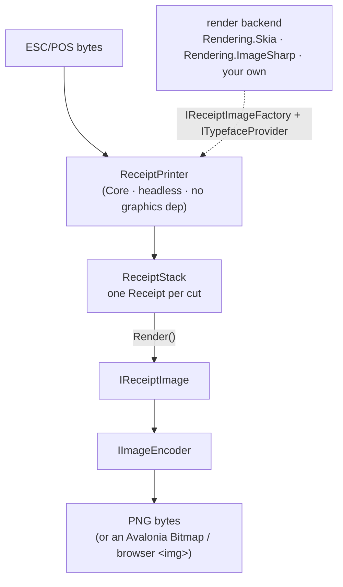

# CrossEscPos documentation

CrossEscPos emulates a networked, serial or USB receipt printer so you can test the ESC/POS your
point-of-sale software sends. It renders the receipts, answers status queries, and simulates paper,
cover, drawer and error states. It ships as:

- a desktop app for Windows, macOS and Linux (Avalonia 12, .NET 10),
- the same app in the browser (Avalonia WebAssembly),
- a headless core you can embed (ESC/POS bytes to PNG, no UI), and
- NuGet packages for each layer, so you take only what you need.

These pages are the project's long-form documentation. They are also published as the
[wiki](https://github.com/danielmeza/CrossEscPosEmulator/wiki); edit them in `docs/`, because the wiki is
regenerated from here.

## Using the emulator

- [Using the app](Using-the-App.md): the Monitor test client, the printer state panel, exporting PNGs,
  choosing the render backend.
- [Connecting](Connecting.md): TCP and serial, environment variables, and testing serial without hardware.
- [Browser app](Browser-App.md): the browser version, its transports, and the SignalR host for TCP.
- [Supported commands](Supported-Commands.md): the emulated printer, the ESC/POS it understands, and
  what is missing.
- [ESC/POS notes](ESC-POS-Notes.md): quirks found while implementing commands.

## Using the libraries

- [Getting started](Getting-Started.md): render your first ticket headless in about 15 lines.
- [Packages](Packages.md): what each library gives you and how they fit together.
- [Core emulator](Core-Emulator.md): feeding ESC/POS, receipts, printer state, status replies, events.
- [Rendering and backends](Rendering-and-Backends.md): the Skia and managed ImageSharp backends, exporting.
- [Adding a render backend](Adding-a-Render-Backend.md): step by step, using the ImageSharp backend as
  the worked example.
- [Transports](Transports.md): feed the emulator over TCP, serial or USB.
- [Controls](Controls.md): the reusable Avalonia `ReceiptView` and `PrinterStatePanel`.

## Working on CrossEscPos

- [Architecture](Architecture.md): the packages, one app with two heads, and the bundled font.
- [Building and testing](Building-and-Testing.md): build every head, run the tests, and how releases,
  the site and this wiki are published.
- [From WPF to Avalonia](../README.md#from-wpf-to-avalonia-what-the-migration-cost): what porting the
  original WPF app took.

## The mental model

`Core` knows nothing about SkiaSharp or Avalonia. The host picks a render backend and injects it, so the
emulation is portable (headless, server, WebAssembly) and the rendering is swappable.
