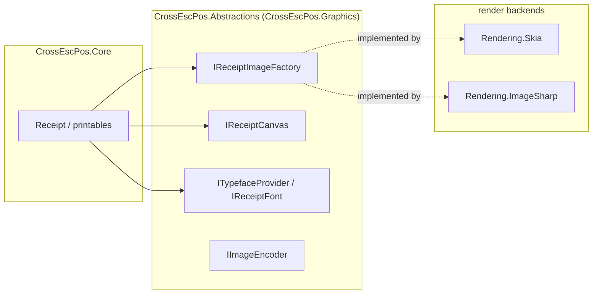

# Rendering & Backends

`CrossEscPos.Core` renders the receipt document model through the **abstraction** in
`CrossEscPos.Abstractions` (`CrossEscPos.Graphics`), never against a concrete graphics library. A
**render backend** implements that abstraction. Two ship in-box:

| Backend | Package | Best for |
| --- | --- | --- |
| **SkiaSharp** (default) | `CrossEscPos.Rendering.Skia` | Desktop / server — fast native rasterization |
| **ImageSharp** (managed) | `CrossEscPos.Rendering.ImageSharp` | the browser (WASM) / anywhere native deps are unwanted — no native relink, byte-compatible output |

Both embed the same monospace font (JetBrains Mono, OFL) and produce the **same receipts**; a host picks
one and injects it. Want to write your own? See **[Adding a Render Backend](Adding-a-Render-Backend.md)**.



## The Skia backend (native, default)

```csharp
using CrossEscPos.Rendering.Skia;

var imageFactory = new SkiaImageFactory();       // IReceiptImageFactory
var typefaces    = new SkiaTypefaceProvider();   // ITypefaceProvider (fonts embedded)
var encoder      = new SkiaImageEncoder();       // IImageEncoder (PNG)
```

Backed by native `libSkiaSharp`. In the browser (WASM) this needs the `wasm-tools` workload and a native relink
of the runtime (a larger `dotnet.native.wasm`).

## The ImageSharp backend (100% managed)

Same three types, same output — but pure managed code, so **no native dependency**. It loads like any
other assembly and runs in **the browser (WASM) with no native relink**.

```csharp
using CrossEscPos.Rendering.ImageSharp;

var imageFactory = new ImageSharpImageFactory();
var typefaces    = new ImageSharpTypefaceProvider();
var encoder      = new ImageSharpImageEncoder();
```

Everything downstream (`ReceiptPrinter`, `Render()`, encoding) is identical — only the injected triple
differs. The desktop app **selects the backend at runtime** (`--render skia` / `--render imagesharp`),
and the two engines are **byte-compatible** — the managed ImageSharp output matches Skia, which is the
whole point of keeping the managed path.

## Exporting

```csharp
using var image = printer.CurrentReceipt.Render();   // IReceiptImage

encoder.EncodePng(image, stream);       // write to a Stream
byte[] png = encoder.EncodePng(image);  // or get the bytes
```

Stack every receipt into one tall image (the "export all" use case):

```csharp
using CrossEscPos.Emulator.Rendering;

var images = printer.ReceiptStack.Where(r => !r.IsEmpty).Select(r => r.Render()).ToList();
using var combined = ReceiptExporter.StackVertical(images, imageFactory);
encoder.EncodePng(combined, output);
foreach (var i in images) i.Dispose();
```

## Anti-aliasing contract

Anti-aliasing is fixed **per primitive** so output is consistent across backends:

| Primitive | AA | Why |
| --- | --- | --- |
| text, lines (underlines) | on | smooth glyphs |
| filled rects | **off** | crisp, scannable barcode / QR modules |
| scaled image draws | sampled | clean bit-image scaling |

A backend that doesn't honor this will render fuzzy barcodes — a common first-write mistake.
