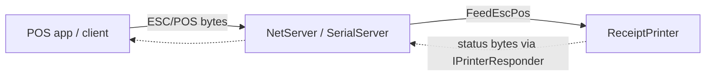

# Transports (`CrossEscPos.Transports`)

Desktop transports that feed an ESC/POS stream into a `ReceiptPrinter` the way a real device receives
it — over **TCP/IP**, a **serial** port, or **USB**. They also implement `IPrinterResponder`, so the
printer's status replies (`DLE EOT`, `GS r`, Automatic Status Back) are sent back over the same channel.

> **Desktop only.** These use raw sockets, `System.IO.Ports` and libusb, which don't exist in the
> browser sandbox — a WASM host feeds ESC/POS in-page instead and doesn't reference this package.



## TCP/IP server

Listens for connections and feeds whatever bytes arrive — how most modern POS software talks to a
network receipt printer (port 9100 by convention).

```csharp
using System.Net;
using CrossEscPos.Transports;

var tcp = new NetServer(printer);
tcp.Start(IPAddress.Any, 9100);
// … tcp.IsRunning, tcp.EndPoint …
tcp.Stop();
```

## Serial server

Reads ESC/POS from an RS-232 / virtual serial port.

```csharp
var serial = new SerialServer(printer);
serial.Start("/dev/ttyUSB0", baudRate: 9600);   // or "COM3" on Windows
// … serial.IsRunning, serial.PortName, serial.BaudRate …
serial.Stop();
```

To test serial without hardware, create a virtual serial bridge (a linked pair of ports) and point the
server at one end and your client at the other — see the repository README's *"Testing serial without
hardware"*.

## USB

`UsbPrinter` is a USB client (libusb) used to drive a real or emulated printer over a bulk endpoint. It
needs the native `libusb-1.0` at runtime (`brew install libusb`, `apt install libusb-1.0-0`; bundled on
Windows).

## Lifetime & threading

Start transports after constructing the printer and stop them on shutdown. Receive happens on a
background thread, so if you bind printer state to a UI, set `printer.UiDispatch` (see
[Core Emulator → Threading](Core-Emulator.md#threading)).

```csharp
tcp.Stop();
serial.Stop();
```

## Browser transports

The [Browser App](Browser-App.md) implements the same `IPrinterResponder` seam over browser APIs
(`CrossEscPos.Transports.Browser`), so the receive → `FeedEscPos` → respond logic is identical to the
desktop ones. There are three:

| Browser transport | Desktop analogue | API |
| --- | --- | --- |
| `WebTransport` (`"serial"`) | `SerialServer` | [Web Serial API](https://developer.mozilla.org/en-US/docs/Web/API/Web_Serial_API) |
| `WebTransport` (`"usb"`) | `UsbPrinter` | [WebUSB API](https://developer.mozilla.org/en-US/docs/Web/API/USB) (CDC-ACM serial polyfill) |
| `SignalRTransport` | `NetServer` (TCP) | [SignalR](https://learn.microsoft.com/aspnet/core/signalr) → the host's TCP listener |

**Web Serial / WebUSB.** A shared `transports.js` owns the device I/O; the Avalonia WASM head bridges to
it with `[JSImport]`/`[JSExport]` (the raw browser interop Avalonia uses). Bytes cross the boundary as
**base64** (received bytes → `DeliverData`; outgoing status via `crossescpos.write`), keeping the interop
marshaling trivial:

```
[device] --bytes--> transports.js (read loop) --base64--> DeliverData --> FeedEscPos
[device] <--bytes-- transports.js (write)     <--base64-- Send        <-- IPrinterResponder
```

**Requirements:** a Chromium browser (Chrome / Edge), a **secure context** (HTTPS or `localhost`), and a
**user gesture** to open the device picker. Direction note: the browser is the *host*, so WebUSB reads a
device's bulk **IN** endpoint (incoming ESC/POS) and writes status to bulk **OUT**.

## Browser TCP over SignalR

A browser can't open a raw **TCP** listen socket, so `SignalRTransport` connects to the broker in
[`samples/CrossEscPos.Host`](Browser-App.md) and asks it to open one on the emulator's behalf. The hub is
strongly typed on both ends via `CrossEscPos.Bridge`:

- `IBridgeServer` — what a client calls: `AttachEmulator(address, port)`, `SendToEmulator(bytes)`,
  `ReplyToSender(bytes)`. The hub is `Hub<IBridgeClient>` implementing this; clients call it through a
  shared `BridgeServerProxy` (no magic strings).
- `IBridgeClient` — what the server calls back: `ReceiveEscPos(bytes)`, `ReceiveStatus(bytes)`.

On connect the emulator sends `AttachEmulator(address, port)`; the host opens a **per-session
`TcpListener`** there (throwing if the port can't be bound). POS software that connects to that port —
or the in-page Monitor over SignalR — has its jobs delivered to the emulator, and the emulator's status
replies routed back. The listener is torn down on disconnect and re-opened after an automatic reconnect.

```
[POS] --TCP--> Host listener --ReceiveEscPos--> emulator --ReplyToSender--> Host --TCP--> [POS]
[Monitor] --SendToEmulator--> Host --ReceiveEscPos--> emulator --ReplyToSender--> Host --ReceiveStatus--> [Monitor]
```
