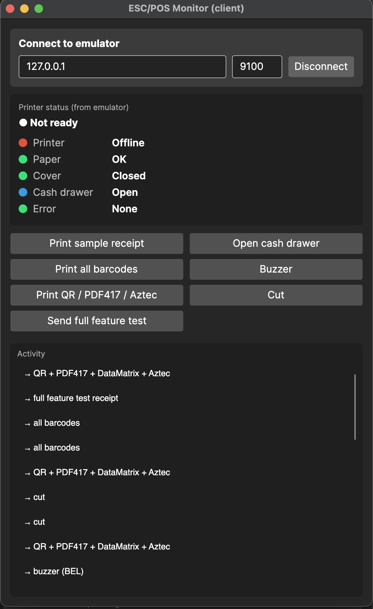

# Using the app

The built-in Monitor test client, the printer state panel, exporting receipts as PNG, and choosing the render backend.

## Monitor (built-in test client)

Sending test jobs is the **monitor's** job — the emulator is the device, the monitor is the POS-side
client that drives it over the wire (just like a real application would). The Monitor is **shared** by
both heads: click **Open monitor…** to launch it — a window on desktop, an in-page overlay in the
browser. Its test jobs and status display are identical; only the transport differs:

- **Desktop** (built on [ESC-POS-.NET](https://github.com/lukevp/ESC-POS-.NET)) — pick a transport:
  - **TCP/IP** — connect to the emulator's listener (or any networked printer).
  - **Serial** — pick a port + baud; pairs with the emulator's serial transport via a virtual port bridge.
  - **USB** — print **directly to a real USB printer** selected from the connected-device list (by
    VID:PID), via libusb. This is send-only (no status), and needs native **libusb** installed
    (macOS `brew install libusb`, Debian/Ubuntu `apt install libusb-1.0-0`; bundled on Windows) and the
    OS not already holding the device.
- **Browser** — sends over the **SignalR proxy** (the `CrossEscPos.Host` hub) to the in-page emulator,
  for a full round-trip without any native transport.

It then lets you exercise the target without writing any code:

- Print a sample receipt, all 1D barcodes, or QR / PDF417 / DataMatrix / Aztec.
- Send the full feature test receipt, open the cash drawer, buzz, or cut.
- Watch the **printer status** the emulator reports back: toggle paper-out / cover / drawer / offline
  in the **Printer state** panel and the monitor's status display updates live (via Automatic Status
  Back), confirming the emulator's status responses are wire-correct. When the printer isn't ready,
  the emulator drops the job and shows a notification, just like real hardware.



Toggling the emulator's **Printer state** panel pushes status to the monitor in real time — here the
printer reports *paper low* and a *recoverable error*, so the monitor shows **Not ready**:


## Exporting tickets

Each cut (`ESC i` / `ESC m` / `GS V`) starts a new receipt — a "page". The **Export** buttons in the
left panel save the rendered tickets as PNG:

- **Export all (single image)** — stacks every receipt into one tall PNG (a save dialog).
- **Export each cut (folder)** — writes one `receipt_NNN.png` per cut into a chosen folder.

## Choosing the render backend

Pick the render backend (for A/B testing the two rendering libraries) with `--backend skia`
(default) or `--backend imagesharp` (the managed, no-native backend). The active backend is shown in
the window title bar.

```sh
dotnet run --project src/CrossEscPos.App.Desktop -- --backend imagesharp   # managed ImageSharp backend
dotnet run --project src/CrossEscPos.App.Desktop -- --backend skia         # default SkiaSharp backend
```

The `ESCPOS_RENDER_BACKEND` environment variable does the same; see [Connecting](Connecting.md#tcp-and-serial).
