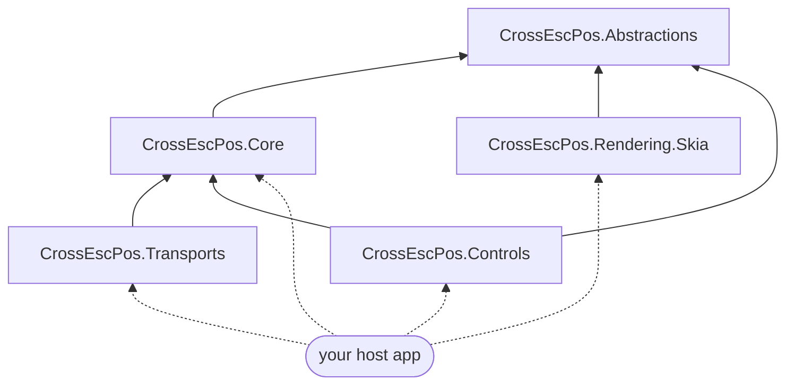
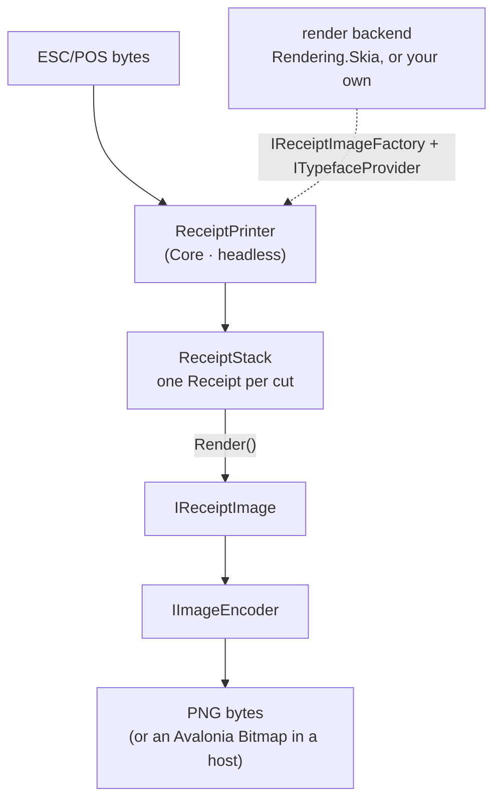

# Using the CrossEscPos packages

CrossEscPos is split into layered, independently-usable packages so you can take only what you need —
the headless emulator, a render backend, the transports, and/or the Avalonia controls.

| Package | What it gives you | Depends on |
| --- | --- | --- |
| **CrossEscPos.Abstractions** | Backend-agnostic contracts: `IReceiptCanvas`, `IReceiptImage`, `IReceiptImageFactory`, `ITypefaceProvider`, `IImageEncoder`, `IReceiptPrintable`, `IPrinterResponder` | — |
| **CrossEscPos.Core** | The headless ESC/POS emulator: `ReceiptPrinter`, the interpreter, the receipt document model, barcode/QR | Abstractions |
| **CrossEscPos.Rendering.Skia** | The default render backend (SkiaSharp); fonts embedded | Abstractions |
| **CrossEscPos.Transports** | TCP / serial / USB transports that feed a printer | Core |
| **CrossEscPos.Controls** | Reusable Avalonia controls: `ReceiptView`, `PrinterStatePanel` | Core, Avalonia |

Everything lives under the single `CrossEscPos.*` namespace root (organized by feature, e.g.
`CrossEscPos.Emulator`, `CrossEscPos.Graphics`, `CrossEscPos.Controls`), so types resolve across the
packages regardless of which one they ship in.

## How the packages depend on each other



## The mental model



`Core` knows **nothing** about SkiaSharp or Avalonia. You — the host — pick a render backend and inject
it. That's the whole design: the emulation is portable (headless, server, WASM); rendering is swappable.

## Guides

- **[Getting started](getting-started.md)** — install and render your first ticket headless.
- **[Core](core.md)** — feeding ESC/POS, receipts, printer state, status responses, events.
- **[Rendering](rendering.md)** — the Skia backend, exporting PNGs, and writing your own backend.
- **[Controls](controls.md)** — hosting `ReceiptView` and `PrinterStatePanel` in an Avalonia app.
- **[Transports](transports.md)** — driving the emulator over TCP, serial, or USB.
- **[WASM JS interop](wasm-interop.md)** — render ESC/POS to PNG from any JavaScript project (no .NET).

## Installing

These packages are produced by this repository. Once published to NuGet:

```sh
dotnet add package CrossEscPos.Core
dotnet add package CrossEscPos.Rendering.Skia
# …and Controls / Transports as needed
```

Until then, build them locally and consume the `.nupkg`s, or reference the projects directly:

```sh
dotnet pack -c Release          # emits the .nupkg files under each project's bin/Release
# or
dotnet add reference ../CrossEscPosEmulator/src/CrossEscPos.Core/CrossEscPos.Core.csproj
```
