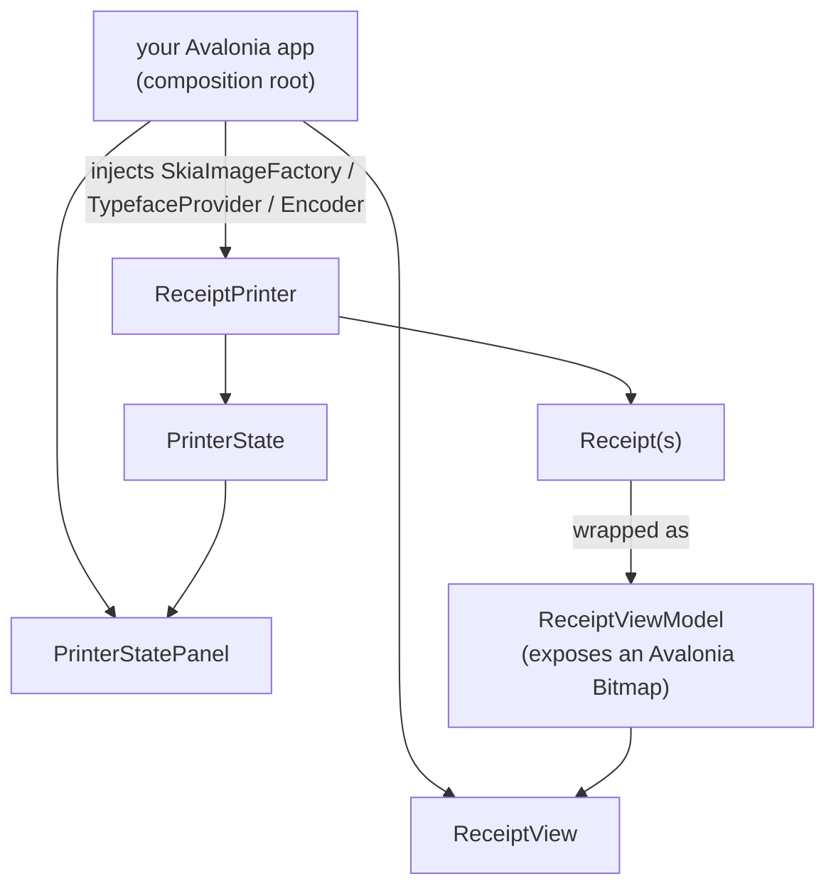

# CrossEscPos.Controls

Reusable Avalonia controls so a host app can show a live receipt stream and drive the simulated printer
state. The controls are **backend-agnostic** — they depend on the abstraction, not on SkiaSharp. Your
app is the composition root that picks the render backend.



## The controls

### `ReceiptView`

Renders the live stream of receipts (one image per cut) with a per-page PNG export button. Bind its
`Receipts` property to an `IEnumerable` of `ReceiptViewModel`.

```xml
<UserControl xmlns:controls="using:CrossEscPos.Controls">
    <controls:ReceiptView Receipts="{Binding Receipts}" />
</UserControl>
```

It also exposes `ScrollToEnd()` so the host can keep the newest receipt in view.

### `PrinterStatePanel`

Two-way binds the simulated `PrinterState` (online, cover, paper, drawer, error, feed button). Toggling
it drives the status commands the emulator reports.

```xml
<controls:PrinterStatePanel State="{Binding State}" />
```

## Wiring it up

`ReceiptViewModel` wraps a `Receipt` and exposes a ready-to-bind Avalonia `Bitmap`. It reaches the
render backend only through `IImageEncoder`, so the control never sees SkiaSharp.

```csharp
using CrossEscPos.Controls;
using CrossEscPos.Controls.Services;
using CrossEscPos.Emulator;
using CrossEscPos.Rendering.Skia;

public partial class MainViewModel : ObservableObject
{
    private readonly ReceiptPrinter _printer;
    private readonly SkiaImageEncoder _encoder = new();
    private readonly IFileDialogService _dialogs;   // your Avalonia implementation

    public ObservableCollection<ReceiptViewModel> Receipts { get; } = new();
    public PrinterState State => _printer.State;

    public MainViewModel(IFileDialogService dialogs)
    {
        _dialogs = dialogs;
        _printer = new ReceiptPrinter(PaperConfiguration.Default, new SkiaImageFactory(), new SkiaTypefaceProvider());
        // Marshal off-thread state changes (e.g. a TCP drawer kick) onto the UI thread.
        _printer.UiDispatch = a => Dispatcher.UIThread.Post(a);
    }

    // Call after feeding ESC/POS to (re)build the bound view models.
    private void Refresh()
    {
        Receipts.Clear();
        int index = 1;
        foreach (var receipt in _printer.ReceiptStack)
        {
            if (receipt.IsEmpty) continue;
            Receipts.Add(new ReceiptViewModel(receipt, _encoder, _dialogs, index++));
        }
    }
}
```

## Service interfaces

The controls depend on two small host-provided services (in `CrossEscPos.Controls.Services`):

- `IFileDialogService` — `SavePngAsync(suggestedName)` and `PickFolderAsync()` for the export buttons.
- `INotificationService` — surface buzzer / cash-drawer / activity events (sound, taskbar flash, …).

The desktop app provides Avalonia implementations; a browser/headless host can stub them (e.g. return
`null` from the dialogs to disable export).

## Converting an image yourself

If you render outside the view models, `AvaloniaImageExtensions` bridges an `IReceiptImage` to an
Avalonia `Bitmap` via PNG (no SkiaSharp dependency in your UI code):

```csharp
using CrossEscPos.Controls;

Bitmap bmp = receiptImage.ToAvaloniaBitmap(encoder);
```
