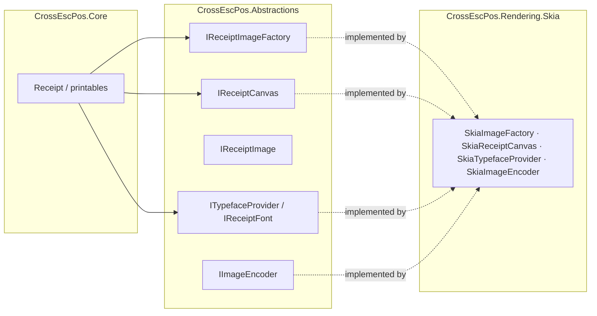

# Rendering: the Skia backend and writing your own

`CrossEscPos.Core` renders the receipt document model through the **abstraction** in
`CrossEscPos.Abstractions` (`CrossEscPos.Graphics`), never against a concrete graphics library. A
**render backend** implements that abstraction. `CrossEscPos.Rendering.Skia` is the default one.



## The Skia backend

```csharp
using CrossEscPos.Rendering.Skia;

var imageFactory = new SkiaImageFactory();      // IReceiptImageFactory
var typefaces    = new SkiaTypefaceProvider();   // ITypefaceProvider (fonts embedded)
var encoder      = new SkiaImageEncoder();       // IImageEncoder (PNG)
```

The monospace receipt font (JetBrains Mono) is embedded in this package and loaded from memory, so it
renders identically on every OS and works in the browser sandbox with no file IO.

## Exporting

```csharp
using var image = printer.CurrentReceipt.Render();   // IReceiptImage

encoder.EncodePng(image, stream);    // write to a Stream
byte[] png = encoder.EncodePng(image);  // or get the bytes
```

Stack every receipt into one tall image (the "export all" use case):

```csharp
using CrossEscPos.Emulator.Rendering;

var images = printer.ReceiptStack.Where(r => !r.IsEmpty).Select(r => r.Render()).ToList();
using var combined = ReceiptExporter.StackVertical(images, imageFactory);
encoder.EncodePng(combined, output);
foreach (var i in images) i.Dispose();
```

## Writing your own backend

Want a non-Skia backend (System.Drawing, ImageSharp, an HTML5 canvas in WASM, a null/measuring
backend…)? Implement these and inject them — `Core` is none the wiser.

| Interface | Responsibility |
| --- | --- |
| `IReceiptImageFactory` | create blank images, build images from raw pixels, and create a canvas over an image |
| `IReceiptCanvas` | draw text, rects, lines and images; transform stack (`Save`/`Translate`/`Scale`/`RestoreToCount`) |
| `IReceiptImage` | a rasterized image (`Width`, `Height`, `Copy`) |
| `ITypefaceProvider` / `IReceiptFont` | resolve a font by family/bold/italic/size; measure text + metrics |
| `IImageEncoder` | encode an `IReceiptImage` to PNG |

Anti-aliasing is fixed per primitive to keep output consistent: text and lines are anti-aliased,
filled rects are not (crisp barcode modules), scaled image draws are sampled. A minimal sketch:

```csharp
using CrossEscPos.Graphics;

public sealed class MyImageFactory : IReceiptImageFactory
{
    public IReceiptImage Create(int w, int h, ReceiptColor fill) => /* … */;
    public IReceiptImage FromPixels(int w, int h, ReceiptColor[] rowMajor) => /* … */;
    public IReceiptCanvas CreateCanvas(IReceiptImage image) => /* … */;
}

// …plus MyReceiptCanvas : IReceiptCanvas, MyTypefaceProvider : ITypefaceProvider, etc.

var printer = new ReceiptPrinter(PaperConfiguration.Default, new MyImageFactory(), new MyTypefaceProvider());
```

That's the entire contract for swapping the render layer.
