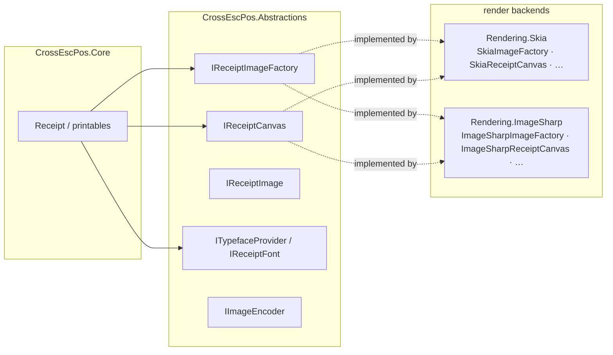

# Rendering: the backends and writing your own

`CrossEscPos.Core` renders the receipt document model through the **abstraction** in
`CrossEscPos.Abstractions` (`CrossEscPos.Graphics`), never against a concrete graphics library. A
**render backend** implements that abstraction. Two ship in-box:

| Backend | Package | Best for |
| --- | --- | --- |
| **SkiaSharp** (default) | `CrossEscPos.Rendering.Skia` | Desktop / server — fast native rasterization |
| **ImageSharp** (managed) | `CrossEscPos.Rendering.ImageSharp` | Blazor WASM / anywhere native deps are unwanted — no native relink, byte-compatible output |

Both embed the same monospace font and produce the **same receipts**; a host picks one and injects it.



## The Skia backend (native, default)

```csharp
using CrossEscPos.Rendering.Skia;

var imageFactory = new SkiaImageFactory();       // IReceiptImageFactory
var typefaces    = new SkiaTypefaceProvider();   // ITypefaceProvider (fonts embedded)
var encoder      = new SkiaImageEncoder();       // IImageEncoder (PNG)
```

Backed by native `libSkiaSharp`. In Blazor WASM this needs the `wasm-tools` workload and a native
relink of the runtime (a larger `dotnet.native.wasm`).

## The ImageSharp backend (100% managed)

Same three types, same output — but pure managed code (SixLabors.ImageSharp), so **no native
dependency**. It loads like any other assembly and runs in **Blazor WASM with no native relink**.

```csharp
using CrossEscPos.Rendering.ImageSharp;

var imageFactory = new ImageSharpImageFactory();       // IReceiptImageFactory
var typefaces    = new ImageSharpTypefaceProvider();   // ITypefaceProvider (fonts embedded)
var encoder      = new ImageSharpImageEncoder();       // IImageEncoder (PNG)
```

Everything downstream (`ReceiptPrinter`, `Render()`, encoding) is identical — only the injected triple
differs. See the [Blazor web app](web.md), which lets you switch between the two engines at runtime.

The monospace receipt font (JetBrains Mono, OFL) is embedded in each backend and loaded from memory, so
receipts render identically on every OS and inside the browser sandbox with no file IO.

## Exporting

```csharp
using var image = printer.CurrentReceipt.Render();   // IReceiptImage

encoder.EncodePng(image, stream);    // write to a Stream
byte[] png = encoder.EncodePng(image);  // or get the bytes
```

Stack every receipt into one tall image (the "export all" use case):

```csharp
using CrossEscPos.Emulator.Rendering;

var images = printer.ReceiptStack.Where(r => !r.IsEmpty).Select(r => r.Render()).ToList();
using var combined = ReceiptExporter.StackVertical(images, imageFactory);
encoder.EncodePng(combined, output);
foreach (var i in images) i.Dispose();
```

## Writing your own backend

Want a different backend (System.Drawing, a GPU canvas, an HTML5 `<canvas>`, a null/measuring backend…)?
Implement these five interfaces and inject them — `Core` is none the wiser.

| Interface | Responsibility |
| --- | --- |
| `IReceiptImageFactory` | create blank images, build images from raw pixels, and create a canvas over an image |
| `IReceiptCanvas` | draw text, rects, lines and images; transform stack (`Save`/`Translate`/`Scale`/`RestoreToCount`) |
| `IReceiptImage` | a rasterized image (`Width`, `Height`, `Copy`) |
| `ITypefaceProvider` / `IReceiptFont` | resolve a font by family/bold/italic/size; measure text (**advance width**) + metrics |
| `IImageEncoder` | encode an `IReceiptImage` to PNG |

Anti-aliasing is fixed per primitive to keep output consistent: text and lines are anti-aliased,
filled rects are not (crisp barcode modules), scaled image draws are sampled. A minimal sketch:

```csharp
using CrossEscPos.Graphics;

public sealed class MyImageFactory : IReceiptImageFactory
{
    public IReceiptImage Create(int w, int h, ReceiptColor fill) => /* … */;
    public IReceiptImage FromPixels(int w, int h, ReceiptColor[] rowMajor) => /* … */;
    public IReceiptCanvas CreateCanvas(IReceiptImage image) => /* … */;
}

// …plus MyReceiptCanvas : IReceiptCanvas, MyTypefaceProvider : ITypefaceProvider, etc.

var printer = new ReceiptPrinter(PaperConfiguration.Default, new MyImageFactory(), new MyTypefaceProvider());
```

That's the entire contract for swapping the render layer.

### 📌 Worked example — the ImageSharp backend (PR #11)

`CrossEscPos.Rendering.ImageSharp` is itself the reference sample for adding a backend: it mirrors the
Skia one class-for-class against the same contract. Study it end-to-end in
[**PR #11**](https://github.com/danielmeza/CrossEscPosEmulator/pull/11) (by
[@yhonc9](https://github.com/yhonc9)) and the sources under
[`src/CrossEscPos.Rendering.ImageSharp/`](../../src/CrossEscPos.Rendering.ImageSharp).

A couple of contract subtleties that PR worked through — worth knowing if you write your own:

- **`IReceiptFont.MeasureText` must return the *advance width*** (like `SKFont.MeasureText`), counting
  side bearings **and** trailing whitespace — the layout justifies and advances runs on it. ImageSharp's
  `TextMeasurer.MeasureSize` returns glyph *bounds* (wrong); `MeasureAdvance` returns the advance, but
  still trims trailing whitespace, so the backend re-adds it with a sentinel.
- **`FontMetrics` uses the Skia sign convention** — `Ascent` negative, `Descent` positive.
- **The transform stack** (`Save`/`Translate`/`Scale`/`RestoreToCount`) must apply per draw op —
  translate outermost, scale inner — so double-width/height text scales correctly.

The step-by-step **[Adding a render backend](https://github.com/danielmeza/CrossEscPosEmulator/wiki/Adding-a-Render-Backend)**
guide in the wiki walks through each interface using that backend as the model.
