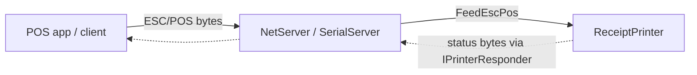

# CrossEscPos.Transports

Desktop transports that feed an ESC/POS stream into a `ReceiptPrinter` the way a real device receives
it — over **TCP/IP**, a **serial** port, or **USB**. They also implement `IPrinterResponder`, so the
printer's status replies (`DLE EOT`, `GS r`, Automatic Status Back) are sent back over the same channel.

> Desktop only. These use raw sockets, `System.IO.Ports` and libusb, which don't exist in the browser
> sandbox — a WASM host feeds ESC/POS in-page instead and doesn't reference this package.



## TCP/IP server

Listens for connections and feeds whatever bytes arrive. This is how most modern POS software talks to
a network receipt printer (port 9100 by convention).

```csharp
using System.Net;
using CrossEscPos.Transports;

var tcp = new NetServer(printer);
tcp.Start(IPAddress.Any, 9100);
// … tcp.IsRunning, tcp.EndPoint …
tcp.Stop();
```

## Serial server

Reads ESC/POS from an RS-232 / virtual serial port.

```csharp
var serial = new SerialServer(printer);
serial.Start("/dev/ttyUSB0", baudRate: 9600);   // or "COM3" on Windows
// … serial.IsRunning, serial.PortName, serial.BaudRate …
serial.Stop();
```

To test serial without hardware, create a virtual serial bridge (a linked pair of ports) and point the
server at one end and your client at the other — see the main README's "Testing serial without hardware".

## USB

`UsbPrinter` is a USB client (libusb) used to drive a real or emulated printer over a bulk endpoint. It
needs the native `libusb-1.0` at runtime (`brew install libusb`, `apt install libusb-1.0-0`; bundled on
Windows).

## Lifetime

Start the transports after constructing the printer, and stop them on shutdown:

```csharp
tcp.Stop();
serial.Stop();
```

Because receive happens on a background thread, set `printer.UiDispatch` if you bind printer state to a
UI (see [Core](core.md#threading)).
