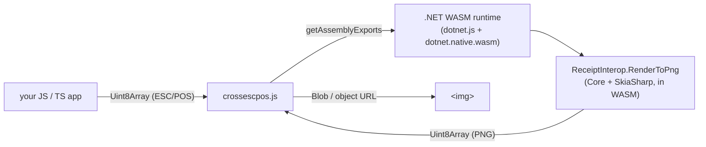

# WASM JavaScript interop — use CrossEscPos from any web project

`CrossEscPos.Wasm` is a **headless** WebAssembly module (the Core emulator + the SkiaSharp backend, no
Avalonia) that renders ESC/POS to PNG **in the browser** and exposes that to JavaScript via `[JSExport]`.
Any web project — plain JS, React, Vue, Svelte, Angular — can call it; no .NET on the caller's side.



## The JavaScript API

Copy [`crossescpos.js`](../../src/CrossEscPos.Wasm/wwwroot/crossescpos.js) into your project and import it:

```js
import * as CrossEscPos from './crossescpos.js';

// escpos is a Uint8Array of raw ESC/POS bytes
const url = await CrossEscPos.renderToObjectUrl(escpos);
document.querySelector('img').src = url;   // URL.revokeObjectURL(url) when done
```

| Function | Returns |
| --- | --- |
| `renderToPng(escpos)` | `Promise<Uint8Array>` — PNG bytes (every receipt stacked) |
| `renderToBlob(escpos)` | `Promise<Blob>` (`image/png`) |
| `renderToObjectUrl(escpos)` | `Promise<string>` — an object URL for `.src` |
| `renderToDataUrl(escpos)` | `Promise<string>` — a `data:` URL |
| `countReceipts(escpos)` | `Promise<number>` — receipts (cuts) the stream produces |

The runtime boots lazily on the first call and is reused after that.

## Building the module

The module needs the **wasm-tools workload** (it links SkiaSharp's native `libSkiaSharp.a` into the
runtime, an Emscripten step):

```sh
dotnet workload install wasm-tools
```

### Run the demo

```sh
dotnet run --project src/CrossEscPos.Wasm
```

This serves a small page (`wwwroot/index.html` + `demo.js`) showing the wrapper in action — type text or
load the bundled sample ticket and see it rendered.

### Publish for production

```sh
dotnet publish src/CrossEscPos.Wasm -c Release -o publish/wasm
```

`publish/wasm/wwwroot/` is a static site you can host anywhere (it's just files — no server runtime):

```
wwwroot/
├── _framework/        ← the .NET WASM runtime + assemblies (incl. SkiaSharp native)
├── crossescpos.js     ← the wrapper you import
├── index.html         ← demo (optional)
└── …
```

## Integrating into an existing JS/TS project

1. `dotnet publish` the module (above).
2. Copy the published **`_framework/`** directory and **`crossescpos.js`** into your app's static assets,
   keeping `crossescpos.js` as a sibling of `_framework/` (it imports `./_framework/dotnet.js`).
3. Import and call it:

   ```js
   import * as CrossEscPos from './crossescpos.js';
   const png = await CrossEscPos.renderToBlob(escposBytes);
   ```

Bundler notes: serve `_framework/` as static files (don't let a bundler rewrite the `.wasm`/`.js` paths);
the dynamic `import('./_framework/dotnet.js')` must resolve at runtime relative to `crossescpos.js`.

## Notes & limits

- **Payload size.** The runtime includes SkiaSharp's native (`dotnet.native.wasm` ≈ 23 MB, served gzipped
  and browser-cached after first load). It's a render engine compiled to WASM — sizeable but one-time.
- **Cross-origin isolation.** Standard single-threaded WASM; no special COOP/COEP headers required.
- **What it does.** Pure rendering: ESC/POS bytes → PNG. The transports (TCP/serial/USB) are desktop-only
  and intentionally excluded. Feed bytes you already have (from a file, a WebSocket, a paste box, …).
- **Want the full interactive UI instead?** That's the Avalonia browser app
  ([`src/CrossEscPos.App.Browser`](../../src/CrossEscPos.App.Browser)), a different artifact.
