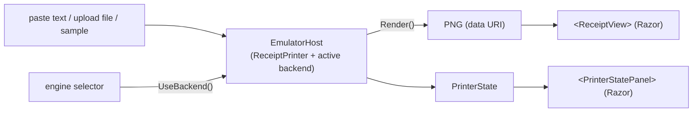

# Blazor web app — render ESC/POS in the browser

[`samples/CrossEscPos.Web`](../../samples/CrossEscPos.Web) is a **Blazor WebAssembly** app that runs the
whole emulator in the browser: feed it ESC/POS, see the rendered receipt, and **switch the render engine
at runtime** — managed **ImageSharp** (default) or native **SkiaSharp**. It's the showcase for the
managed backend: with ImageSharp there's **no native relink** and the runtime stays the stock size.



## Run it

```sh
dotnet run --project samples/CrossEscPos.Web
```

Opens a dev server; the page auto-renders a sample ticket. Pick the engine on the left, paste ESC/POS
text or upload a `.escpos` file, and the receipt renders on the fly. The active engine is remembered
across reloads (`localStorage`).

> **Building requires the `wasm-tools` workload** (`dotnet workload install wasm-tools`). Because the app
> includes **both** engines, SkiaSharp's native `libSkiaSharp.a` is relinked into the runtime
> (`dotnet.native.wasm` ≈ 23 MB). ImageSharp alone needs none of that — that's the whole point of the
> managed backend; the app carries Skia only so you can A/B the two in one place.

## How it's wired

The app is a thin shell over the same headless `Core` the desktop uses — the only browser-specific part
is the composition root.

| Piece | Role |
| --- | --- |
| [`RenderBackend`](../../samples/CrossEscPos.Web/Rendering/RenderBackend.cs) | A small **named registry** — resolves `"imagesharp"` / `"skia"` to a factory + typefaces + encoder triple |
| [`EmulatorHost`](../../samples/CrossEscPos.Web/Services/EmulatorHost.cs) | Owns the `ReceiptPrinter` and the active backend; `Render(bytes)`, `UseBackend(id)`, exposes `Receipts` + `State` |
| [`ReceiptView.razor`](../../samples/CrossEscPos.Web/Components/ReceiptView.razor) | Shows one receipt as a PNG with a download link (the Razor analogue of the Avalonia `ReceiptView`) |
| [`PrinterStatePanel.razor`](../../samples/CrossEscPos.Web/Components/PrinterStatePanel.razor) | Two-way binds the `PrinterState` (online, cover, paper, drawer, …) |

Switching the engine simply re-creates the printer with the other backend triple and re-renders the
current input — the core, the receipt model, and the Razor components are all backend-agnostic.

```csharp
// EmulatorHost — the essence of the runtime switch
public void UseBackend(string id)
{
    var next = RenderBackend.ById(id);      // "imagesharp" | "skia"
    if (next.Id == _backend.Id) return;
    _backend = next;
    Rebuild(preserveState: true);            // new factory/typefaces/encoder; replay last input
}
```

## Publish

```sh
dotnet publish samples/CrossEscPos.Web -c Release -o publish/web
```

`publish/web/wwwroot/` is a static site (no server runtime) you can host anywhere — GitHub Pages, a CDN,
any static host. Serve `_framework/` as static files.

## Just want ESC/POS → PNG, no UI?

Reference `CrossEscPos.Core` + `CrossEscPos.Rendering.ImageSharp` directly in your own Blazor app and
call the two-line pipeline from [Getting started](getting-started.md) — the managed backend means it
"just works" in WASM with no extra toolchain.

## The full interactive desktop app

For the native desktop emulator (TCP/serial/USB transports, live UI) see
[`src/CrossEscPos.App.Desktop`](../../src/CrossEscPos.App.Desktop); it can also switch backends at
runtime with `--backend skia|imagesharp`.
